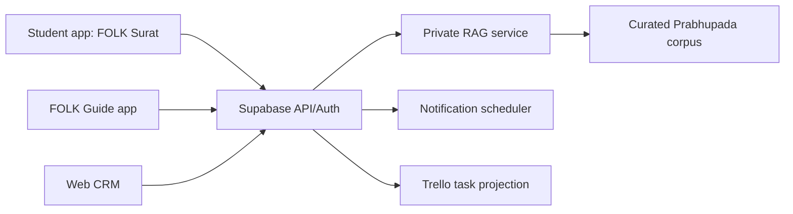

# Architecture

## System of record

Supabase is the canonical backend for identity-linked application data, relationships, sadhana, interaction summaries, progress, calendars, tasks, approvals, content metadata, and notifications. Row Level Security is mandatory.

## Surfaces

## Integration rules

- Google OAuth is the only authentication route.
- Google Meet attendance should use approved Calendar/Meet APIs when feasible; otherwise record guide-confirmed association minutes. Do not infer exact attendance from a link click.
- App appointment requests may create proposed slots; confirmed events can generate a calendar event and a portable JSON summary shared to student and guide.
- YouTube and audio are streamed/embedded with source attribution, not bundled into the APK.
- Trello receives operational tasks with opaque student identifiers and safe summaries; sensitive pastoral notes remain only in Supabase.
- RAG indexing should run locally/private first. Store chunk IDs, source metadata, citations, and embeddings separately from application transactions.

## Environments

Private test only at present. Separate debug application IDs are installed so existing signed apps remain untouched:

- `com.example.folk_app.test`
- `com.example.folk_guide_app.test`

